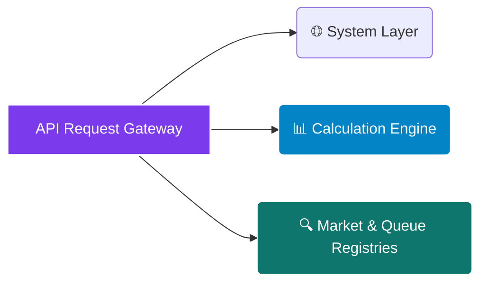

# <p align="center"></p>

<div align="center">

  <p><strong>The Only Lender-Grade Solar Incentive Stack &amp; Tax Equity Underwriting Engine Purpose-Built for Commercial §48 IRA 2022 Compliance</strong></p>

</div>

<div align="center">

  <a href="https://rapidapi.com/bethelnedi/api/solar-incentive-intelligence-api"></a>
  <a href="https://elements.stoplight.io/viewer/?spec=https://raw.githubusercontent.com/bethelhash/Solar-Incentive-Intelligence-API/refs/heads/main/openapi.json"></a>
  
  
  

</div>

---

## ⚡ Executive Summary

The **Solar Incentive Intelligence API** is a deterministic, low-latency computational engine designed to eliminate manual regulatory compliance tracking for commercial solar developers, EPCs, tax equity investors, and lending platforms. 

By modeling the complete multi-variable **Inflation Reduction Act (IRA) 2022 Bonus Adder Stack**, real-time SREC spot markets, 50-state statutory incentive rules, and utility interconnection constraints, the engine maximizes investment tax credits from a baseline of **30% up to an advanced 60%** inside a single endpoint payload executed in **under 500ms**.

<blockquote align="left">

  <strong>💎 AUDIT-READY VERIFICATION MATRIX</strong><br>

  Every computational output traces back directly to a named, verified statutory text, IRS Notice, Revenue Procedure, state tax statute, or utility commission order. This eliminates black-box compliance risks and provides a rigorous data structure designed to pass institutional credit committees and strict tax equity audits.

</blockquote>

---

## 🏛️ Enterprise Core Capabilities

<table width="100%">
  <tr>
    <td width="50%" valign="top">
      <h3>📈 Advanced Tax Equity Underwriting</h3>
      <ul>
        <li><strong>Dynamic Adder Stacking:</strong> Simultaneously models interactions between Energy Community, Domestic Content, and Section 48(e) Low-Income allocations.</li>
        <li><strong>50-State Statutory Coverage:</strong> Accesses an updated policy database covering local state-level rebates, tax credits, and performance incentives.</li>
        <li><strong>Lender Memo Automation:</strong> Generates structured regulatory citation maps designed to ingest directly into automated professional PDF print layouts.</li>
      </ul>
    </td>
    <td width="50%" valign="top">
      <h3>🔌 Market Intelligence &amp; Grid Logistics</h3>
      <ul>
        <li><strong>SREC Pricing Projections:</strong> Polls spot-market data across 13 active US markets, factoring in annual asset degradation loops to map exact revenue horizons.</li>
        <li><strong>Interconnection Queue Tracking:</strong> Monitors system capacity, queue positions, and infrastructure constraints across 14 major US utilities.</li>
        <li><strong>Step-Down Monetization:</strong> Automates investment tax credit modifications based on statutory grandfathering rules and structural schedules through 2035.</li>
      </ul>
    </td>
  </tr>
</table>

---

## 🗺️ Market Architecture Hub

### 🌍 Comprehensive Regulatory Coverage
The engine references specific statutory definitions, treasury parameters, geographical boundaries, and allocation timelines across the full federal stack:
`IRA §48 / §48E` &middot; `IRS Notice 2023-29 (Energy Communities)` &middot; `IRS Notice 2023-38 (Domestic Content)` &middot; `IRS Rev. Proc. 2023-27 (Low-Income)`

### 📊 Active SREC Spot Markets
Real-time programmatic tracking handles direct revenue optimization for 13 regional market spaces, featuring premium compliance environments:
`District of Columbia (DC)` &middot; `Massachusetts (MA)` &middot; `New Jersey (NJ)` &middot; `Maryland (MD)` &middot; `Pennsylvania (PA)` &middot; `North Carolina (NC)`

---

## 📂 API Core Endpoint Directory



---

### 🌐 System Layer

* `GET /health` — Returns engine operational uptime status, active semantic versioning parameters, and country maps.
* `GET /pricing` — Exposes structural credit limits, overage rates, and subscription tier parameter limits.

### 📊 Calculation Engine

* `POST /itc/calculate` — High-speed federal pre-feasibility single-site model. Evaluates a project baseline configuration to compute primary eligibility profiles, basic state incentive offsets, and immediate ITC stack summaries. *(Free Tier)*
* `POST /itc/audit-full` — Advanced underwriting payload. Compiles multi-variable geometric adder stacking, checks spatial compliance for energy communities, tracks domestic content thresholds, and outputs a complete, uncompressed 25-year structural cash-flow matrix. *(Pro Tier)*

### 🔍 Market & Queue Registries

* `GET /srec/markets` — Pulls live spot-market pricing across 13 active US jurisdictions, combining pricing with multi-year degradation revenue projections.
* `GET /incentives/state-database` — Resolves deep state-by-state financial incentives with accompanying legal code and statutory citation parameters.
* `GET /interconnection/queues` — Streams real-time capacity and logistics updates across 14 major utility queues.
* `GET /itc/schedule` — Returns the explicit statutory ITC phase-out and step-down baseline array through 2035.

---

## 📈 Engineering Methodology & Verification Matrix

The calculation logic contains no black boxes or general rule-of-thumb estimates. Every programmatic output traces back directly to standard legal and laboratory benchmarks:

| Functional Block | Governing Code / Standard | Enterprise Technical Execution |
| --- | --- | --- |
| **Base Tax Credit Mapping** | IRA 2022 §48 / §48E | Validates the core 30% investment tax credit framework against project size and wage requirements. |
| **Energy Communities** | IRS Notice 2023-29 | Maps statistical tract boundaries, brownfield status, and fossil-fuel employment thresholds (+10%). |
| **Domestic Content** | IRS Notice 2023-38 | Audits mechanical element categorization and manufactured product cost multipliers (+10%). |
| **Low-Income Allocation** | IRS Rev. Proc. 2023-27 | Verifies project geometry for low-income residential, tribal land, or affordable housing adders (+10% to +20%). |
| **Asset Revenue Decay** | IEA PVPS Task 13 Protocols | Extrapolates SREC performance distributions out 25 years against non-linear physical asset degradation. |

---

## 🚀 Quickstart Integration Example (Python)

To run a rapid optimization audit against the compliance gateway using a secure production endpoint, run the script below:

```python
import json
import requests

# Production Endpoint Routing Configuration via RapidAPI Gateway
GATEWAY_URL = "[https://solar-incentive-intelligence-api.p.rapidapi.com/itc/calculate](https://solar-incentive-intelligence-api.p.rapidapi.com/itc/calculate)"

payload = {
    "state": "nj",
    "project_kw_dc": 450,
    "is_commercial_property": True,
    "energy_community_eligible": True,
    "domestic_content_compliant": True,
    "low_income_benefit_category": "affordable_housing"
}

headers = {
    "Content-Type": "application/json",
    "X-RapidAPI-Key": "YOUR_SECURE_MARKETPLACE_TOKEN",
    "X-RapidAPI-Host": "solar-incentive-intelligence-api.p.rapidapi.com"
}

response = requests.post(GATEWAY_URL, json=payload, headers=headers)
data = response.json()

print(json.dumps(data["itc_summary"], indent=2))

```

---

## 💎 Production Access Tiers

| Tier Classification | Monthly Access Fees | Active Rate Latency Caps | Inclusive Data Volume Quota | Programmatic Endpoint Access | Support Service Level |
| --- | --- | --- | --- | --- | --- |
| **Free Tier Core** | $0 / Month | 5 Requests / Minute | 50 Calls / Month | `/itc/calculate` + `/srec/markets` | Open Community Forum |
| **Pro Enterprise** | $29.99 / Month | 1,000 Requests / Hour | Unlimited | Complete Engine Access + Web Tool Demo | Standard Service SLA |
| **Ultra Institutional** | $149 / Month | Uncapped Execution | Unlimited | Full Access + Full White-Label Rights | Dedicated Operations SLA |

* **Platform Tool Access & Sandboxes:** Pro and Ultra tiers unlock direct key validation on the [IRA Tax Credit Audit Tool (ira-audit-tool.vercel.app)](https://ira-audit-tool.vercel.app/). Entering an active Pro token generates automated, comprehensive PDF diligence memos.
* **White-Label Integration Deployment:** Ultra tier subscribers gain structural rights to remove native branding and embed the complete interactive IRA Audit Tool framework inside proprietary developer web apps or client domains (requires a 1-day domain deployment intent evaluation).

---

## 🔒 Proprietary License & Terms

### Intellectual Property Protection

**Copyright © 2026 Axiom Infrastructure Intelligence LLP. All rights reserved.**

The Solar Incentive Intelligence API, its structural multi-variable adder stacking models, database indices, state legal schemas, endpoint routing arrays, and data payloads are the exclusive proprietary intellectual property of Axiom Infrastructure Intelligence LLP. No part of this system layout, parameter mapping design, or logic schema may be redistributed, white-labeled, reverse-engineered, or modified without an executed Master Services Agreement (MSA) and express written licensing permission from the corporate rights holder.

### Technical Disclaimer

All tax calculations, environmental checks, and financial outputs generated by this engine function as advanced pre-feasibility intelligence optimized for project discovery and screening. Project owners must engage a certified public accountant (CPA), specialized tax equity counsel, or a licensed professional engineer before final asset allocation or filing IRS Form 3468.

```

```
